# vite-plugin-norg

[](https://www.npmjs.com/package/vite-plugin-norg)
[](https://github.com/bottd/vite-plugin-norg/actions)
[](LICENSE)

**Neorg processor for Vite** - Transform `.norg` files into HTML, React, or Svelte with full TypeScript support.

> **Built for [Neorg](https://github.com/nvim-neorg/neorg) users, powered by [rust-norg](https://github.com/nvim-neorg/rust-norg)**

## Installation

```bash
npm install -D vite-plugin-norg
```

## Setup

```typescript
import { defineConfig } from 'vite';
import { norgPlugin } from 'vite-plugin-norg';

export default defineConfig({
  plugins: [
    norgPlugin({
      mode: 'html',
    }),
  ],
});
```

### TypeScript

Add a type reference to `app.d.ts` based on your output target:

```typescript
// For Svelte
/// <reference types="vite-plugin-norg/svelte" />

// For React
/// <reference types="vite-plugin-norg/react" />

// For HTML
/// <reference types="vite-plugin-norg/html" />
```

This provides type checking for `.norg` modules

### HTML Output

```javascript
import { metadata, html } from './document.norg';
console.log(metadata.title); // "My Document"
document.body.innerHTML = html;
```

### React Output

```jsx
import { metadata, Component } from './document.norg';

export default function App() {
  return (
    <div>
      <h1>{metadata.title}</h1>
      <Component />
    </div>
  );
}
```

### Svelte Output

```svelte
<script>
  import Document, { metadata } from './document.norg';
</script>

<h1>{metadata.title}</h1>
<Document />
```

## Architecture

```mermaid
graph LR
    A(📝 .norg files) ==> B(⚡ Rust Parser)
    B ==> C(🔧 NAPI Module)
    C ==> D(🚀 Vite Plugin)
    D ==> E{🎨 Generator}
    E ==> F(📄 HTML)
    E ==> G(⚛️ React)
    E ==> H(🔥 Svelte)
    F ==> I(💎 TypeScript Module)
    G ==> I
    H ==> I

    linkStyle default stroke-width:3px
```



## Configuration Reference

```typescript
import type { FilterPattern } from 'vite';
import type { BundledHighlighterOptions, BundledLanguage, BundledTheme } from 'shiki';

interface NorgPluginOptions {
  mode: 'html' | 'react' | 'svelte';
  include?: FilterPattern;
  exclude?: FilterPattern;
  shikiOptions?: BundledHighlighterOptions<BundledLanguage, BundledTheme>;
}
```

### Syntax Highlighting

The plugin automatically applies syntax highlighting to code blocks using [Shiki](https://shiki.style/). You can customize the highlighting themes and languages:

```javascript
norgPlugin({
  mode: 'html',
  shikiOptions: {
    themes: {
      // Optional, GitHub theme applied if none specified
      light: 'github-light',
      dark: 'github-dark',
    },
    // Optional, all langs enabled by default
    langs: ['javascript', 'typescript', 'python'],
  },
});
```

Review the [Shiki documentation](https://shiki.style/guide) for theme and configuration options.

**Requirements:**

- Vite 7.0+
- React 19+ (if using `mode: 'react'`)
- Svelte 5+ (if using `mode: 'svelte'`)

## Development

This project uses Nix flakes and direnv for reproducible development environments.

### Setup

```bash
# Enable direnv
direnv allow

npm install
```

### Development Commands

```bash
# Run tests
npm test
cargo test

# Lint and format
nix fmt
```

## License

MIT © [Drake Bott](https://github.com/bottd)
